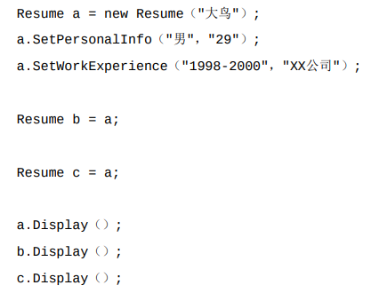

# 原型模式
```
设计初期,同一业务中因多分支中的一个分支不同导致需要创建多个对象时使用
==原型模式其实就是从一个对象再创建另一个可定制对象，而且不需要知道任何创建的细节==
```
例如：复制简历  

方法实现一：


客户端代码  
实现方式一：  


实现方式二:  



```
这样虽然实现了简历的复制但是如果需要复制的次数多了，以及一但有错误，就需要修改多次，很麻烦
虽然客户端可以使用方式二实现，但是在传值过程中a直接传值给b的时候传的引用值(地址)，而且不是传的数值
在这我们就可以使用一种设计模式——原型模式
```
该编代码后：
```java
//简历类
class Resume implements Cloneable{
    private String name;
    private String sex;
    private String age;
    private String timeArea;
    private String company;
    //省略get set方法
    
    //实现clone接口方法
    public Resume clone(){
        Resume object = null;
        try{
            object  = (Resume) super.clone();//此处用来克隆对象
        }catch (CloneNotSupportedException exception){
            System.out.println("clone异常");
        }
        return object;
    }
}
```
客户端代码：

```
使用该方式实现可以提高程序的执行效率，避免构造函数执行时间过长出现的情况，
该方式只是优化了代码的执行效率，但根本的对象复制问题还是没有解决，那该怎么办呢?
将简历类中多了工作经历类的情况下进行复制
```


客户端代码：


结果展示： 


```
接口中工作经验的类中全部都展示第三次书写的经验，这是为什么呢？
根本原因在于对象的复制中进行的是浅拷贝，复制的是对象的地址而不是对象的制，所以三次工作经验的赋值中，
每一次的赋值都将前面的值给覆盖掉了，而最后执行的三个类中的工作经验类的地址又没有发生变化，而导致出现了这样的结果
而深拷贝实现的值的替换
```
## 简历深拷贝实现

工做经验类WorkExperience同样需要实现Clone接口：  


简历类修改：  


